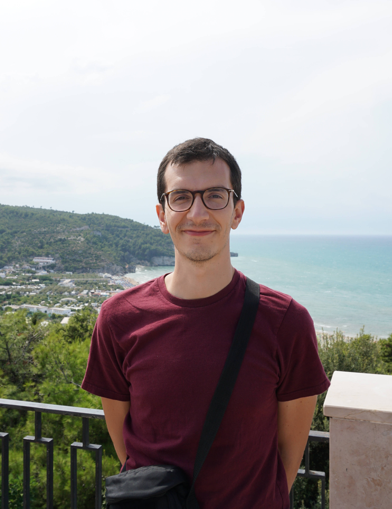

---
# Feel free to add content and custom Front Matter to this file.
# To modify the layout, see https://jekyllrb.com/docs/themes/#overriding-theme-defaults

layout: home
---

  
 

I am a postdoc in the <a href = "https://team.inria.fr/mokaplan/"> MOKAPLAN </a> team at 
<a href ="https://www.inria.fr/centre/paris"> INRIA Paris</a> working with <a href="https://www.ceremade.dauphine.fr/~vialard/"> François-Xavier Vialard </a> and 
<a href="https://who.rocq.inria.fr/Jean-David.Benamou/"> Jean-David Benamou</a>. 

I completed my PhD at <a href="https://www.imperial.ac.uk/"> Imperial College London</a> in 2017 under the supervision of <a href="https://www.imperial.ac.uk/people/colin.cotter"> Colin Cotter</a>.

My research is on the development and analysis of numerical methods for fluids in a variety of contexts, including: 
<ul>
<li>variational models on diffemorphism groups,</li>
<li> structure-preserving finite element discretizations,</li>
<li> simulation of geophysical fluid dynamics models, and</li>
<li> image processing problems arising in experimental fluid dynamics.</li>
</ul>

  

  
  

 

